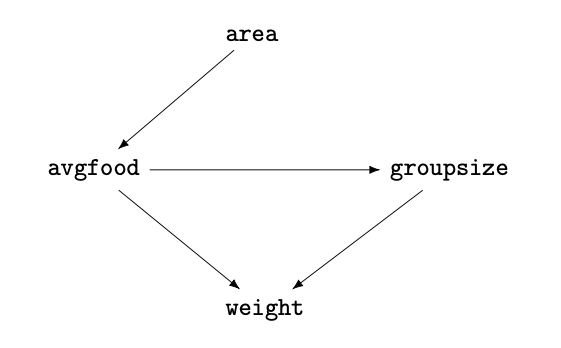

```{r setup, include=FALSE}
knitr::opts_chunk$set(echo = TRUE)
```

### CSP Assignment ps3
Module:    Computational Statistics & Probability - MADS <br>
Professor: Dr. Gregory Wheeler  <br>
Student:   Haowei Lee  <br>
Textbook:  Statistical Rethinking 2nd edition  <br>

Import libraries
```{r, message=FALSE}
library(rethinking)
library(ggplot2)
```

### Question 1
Import and inspect foxes data
```{r}
data(foxes)
d <- foxes
precis(d)
```

###### a)
###### Does territory size have a causal influence the weight of foxes? Construct a quap model to infer the total causal influence of area on weight. Does increasing the area available to each fox make it healthier (i.e., heavier)? I recommend that you standardize your variables and use prior predictive simulation to show that your models predictions stay within the possible outcome range.

```{r}
# standardize the variables
d$w_s <- standardize(d$weight)
d$a_s <- standardize(d$area)
```

```{r}
# build a linear model
modelA <- quap(
  alist(
    w_s ~ dnorm( mu , sigma ),  # weight
    mu <- a + b_area * a_s,
    a ~ dnorm(0,0.2),
    b_area ~ dnorm(0,0.5),
    sigma ~ dexp(1)
  ), data=d )

precis(modelA)   # inspect the result
```
b_area, the coefficient of area, is around 0.018, meaning that territory size barely has a casual influence on weight.

##### b)
##### Now infer the causal impact of adding food (avgfood) to a territory. Would this make foxes heavier? Which covariates do you need to adjust to estimate the total causal influence of food?

```{r}
d$f_s <- standardize(d$avgfood)
modelB <- quap(
  alist(
    w_s ~ dnorm( mu , sigma ),
    mu <- a + b_food * f_s,
    a ~ dnorm(0,0.2),
    b_food ~ dnorm(0,0.5),
    sigma ~ dexp(1)
  ), data=d )

precis(modelB)   # inspect the result
```
b_food, the coefficient of food, is around -0.024, meaning that average food barely has a casual influence on weight.

##### c)
##### Now infer the causal impact of group size (groupsize). Which covariates do you need to adjust to make this estimate? Inspect the posterior distribution of theresulting model. What do you think explains these data? Specifically, explain the estimates of the effects of area, avgfood, and groupsize on weight. How do they make sense together? (Hint: we covered an example in class which exhibited a similar relationship between predictors and outcome variable.)

```{r}
d$g_s <- standardize(d$groupsize)
modelC <- quap(
  alist(
    w_s ~ dnorm( mu , sigma ),
    mu <- a + b_food * f_s + b_group * g_s,
    a ~ dnorm(0,0.2),
    b_food ~ dnorm(0,0.5),
    b_group ~ dnorm(0,0.5),
    sigma ~ dexp(1)
  ), data=d )

precis(modelC)   # inspect the result

```
With the mean of coefficient being -0.57 and 0.48 for group and food, respectively, we can know that group have a negative causal impact on weight, controlling food. In contrast, food has a positive causal effect on weight. To explain, when the size increase in a group of fox, each fox will lose weight. And if average food increases, and only if the group size keeps the same, foxes will gain weight. However, through the analysis on part a, we know that the total casual impact of average food on fox is hardly anything. This implies that there is a masking effect.

This effect could exist between area and average food. When average food increase in an area, foxes tend to move to that area and will soon wash out the advantages on food supply. This kind of active change is like the natural system constantly changing something to reach equilibrium and ensure no place is better than other places in the long run.

### Question 2

##### Explain the difference between model selection and model comparison. What information is lost under model selection?

The main difference between model selection and comparison is that model selection picks the model with the best information criteria value without considering the relative performance of other models, while model comparison does.

To explain, model selection applied different strategies, either cross-validation or information criteria, and determined the accuracy of models by choosing different information criterion such as AIC, DIC, or WAIC. The final model picked would be the one with the best score by using these methods. Doing this will lose information about the relative accuracy of other models.

However, model comparison cares about the relative accuracy. And by observing the standard error of the difference in WAIC between models, we can know how different a model is from the other. Thus, using model comparison, we keep information on relative accuracy and could conduct a more comprehensive analysis of the models and data.

### Question 3

##### Use WAIC or LOO based model comparison on five different models, each using weight as the outcome, and containing the follow sets of predictor variables:

1.  avgfood + groupsize + area

2.  avgfood + groupsize

3.  avgfood + area

4.  avgfood

5.  area

##### Can you explain the relative differences in WAIC scores, using the fox DAG from above? Be sure to pay attention to the standard error of the score differences (dSE).

Load the foxes data and store into a DataFrame
```{r}
# load the data
data(foxes)
d <- foxes
d$area <- scale(d$area)
d$avgfood <- scale(d$avgfood)
d$weight <- scale(d$weight)
d$groupsize <- scale(d$groupsize)
```

Construct models
```{r}
# Construct the models
# (1) avgfood + groupsize + area
m1 <- quap(
  alist(
    weight ~ dnorm(mu, sigma),
    mu <- a + bFood * avgfood + bGroup * groupsize + bArea * area,
    a ~ dnorm(0, 0.2),
    c(bFood, bGroup, bArea) ~ dnorm(0, 0.5),
    sigma ~ dexp(1)
  ),
  data = d
)

# (2) avgfood + groupsize
m2 <- quap(
  alist(
    weight ~ dnorm(mu, sigma),
    mu <- a + bFood * avgfood + bGroup * groupsize,
    a ~ dnorm(0, 0.2),
    c(bFood, bGroup) ~ dnorm(0, 0.5),
    sigma ~ dexp(1)
  ),
  data = d
)

# (3) avgfood + area
m3 <- quap(
  alist(
    weight ~ dnorm(mu, sigma),
    mu <- a + bFood * avgfood + bArea * area,
    a ~ dnorm(0, 0.2),
    c(bFood, bArea) ~ dnorm(0, 0.5),
    sigma ~ dexp(1)
  ),
  data = d
)

# (4) avgfood
m4 <- quap(
  alist(
    weight ~ dnorm(mu, sigma),
    mu <- a + bFood * avgfood,
    a ~ dnorm(0, 0.2),
    bFood ~ dnorm(0, 0.5),
    sigma ~ dexp(1)
  ),
  data = d
)

# (5) area
m5 <- quap(
  alist(
    weight ~ dnorm(mu, sigma),
    mu <- a + bArea * area,
    a ~ dnorm(0, 0.2),
    bArea ~ dnorm(0, 0.5),
    sigma ~ dexp(1)
  ),
  data = d
)
```

Comparison of models
```{r}
compare(m1, m2, m3, m4, m5)
```

Plot out the comparsion
```{r}
## Comparison plot
plot(compare(m1, m2, m3, m4, m5))
```

Overall, the WAIC values are very similar. As dSE implies the standard error of the score differences, we can compare the numbers among all models. While dSE of m2 is closer to m1, dSE of m3, m4, and m5 are closer. In addition, plotting out the comparison also helps us put those models into two different groups of model:

Group A: m1 and m2

Group B: m3 and m4 and m5

To understand the reason behind this, we use the DAG provided in question 1 to explore the relationship among the variables.



In Group A, the first two models (m1 and m2) contain groupsize and average food. Since the casual effect of the area goes directly through average food, it is very similar to just considering average food. Therefore, an extra variable area of m1 does not make a lot of difference from m2. The reason of the similarity of these two models is that there is no back-door path from area or avgfood to weight. In other words, the effect of area affecting groupsize is the same as the effect of avgfood affecting groupsize, because the effect of area goes directly and entirely through avgfood.

In Group B, the last three models (m3, m4 and m5) are also almost identical due to the relationship between area to avgfood. Because the effect of area is routed entirely through avgfood, including only avgfood or area or both should result in the same casual inferences.
